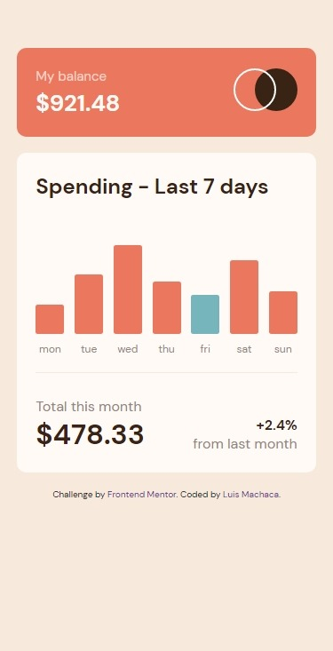
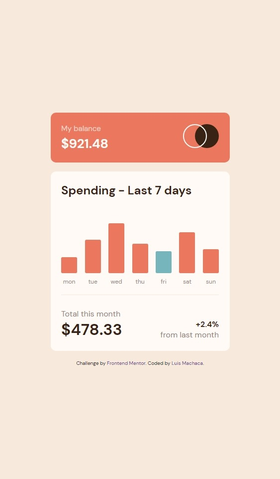
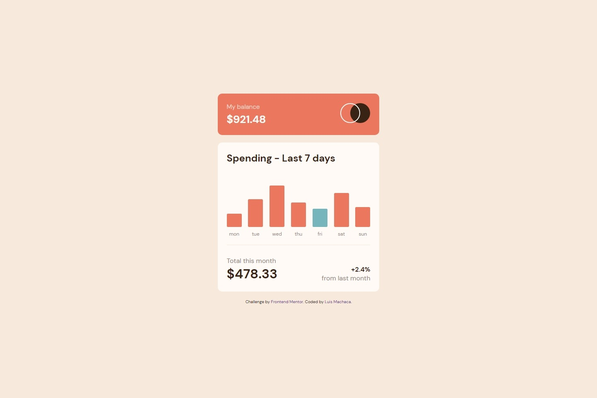

# Frontend Mentor - Expenses chart component solution

This is a solution to the [Expenses chart component challenge on Frontend Mentor](https://www.frontendmentor.io/challenges/expenses-chart-component-e7yJBUdjwt). Frontend Mentor challenges help you improve your coding skills by building realistic projects.

## Table of contents

- [Overview](#overview)
  - [The challenge](#the-challenge)
  - [Screenshot](#screenshot)
  - [Links](#links)
- [My process](#my-process)
  - [Built with](#built-with)
  - [What I learned](#what-i-learned)
  - [Continued development](#continued-development)
  - [Useful resources](#useful-resources)
- [Author](#author)
- [Acknowledgments](#acknowledgments)

## Overview

### The challenge

Users should be able to:

- View the bar chart and hover over the individual bars to see the correct amounts for each day
- See the current day’s bar highlighted in a different colour to the other bars
- View the optimal layout for the content depending on their device’s screen size
- See hover states for all interactive elements on the page
- **Bonus**: Use the JSON data file provided to dynamically size the bars on the chart

### Screenshot





### Links

- Solution URL: [solution URL](https://www.frontendmentor.io/solutions/expenseschartcomponentmain-gNX4YtOjgA)
- Live Site URL: [live site](https://luismacode.github.io/expenses-chart-component-main/)

## My process

### Built with

- Semantic HTML5 markup
- CSS custom properties
- Flexbox
- Mobile-first workflow
- javascript modules
- Bem Naming
  
### What I learned

- This piece code I use to iterate along a list of nodes that corresponds to the bar element and then set its height and animating when sizing

  ```js
    bars.forEach((bar) => {
      const barInner = bar.firstElementChild,
            barHeight = barInner.dataset.height;
      barInner.style = `height:${barHeight}px`;
      barInner.animate([
        { height: "0px" }, 
        { height: `${barHeight}px` }
      ], 
      { duration: 1200 });
  });
  ```

- These two functions are related and helped me get the maximum height and then use their value to get the height of each bar in a percentage-like format.

  ```js
   const getMaxHeight = () => {
      const barsHeight = data.map((i) => Math.round(i.amount));
      return Math.max(...barsHeight);
   };
   const getBarHeight = (item) => {
      const maxHeight = getMaxHeight();
      const barHeight = (Math.round(item) * 100) / maxHeight;
      return barHeight;
   }; 
  ```

- The first function helped me find the current day and then paint the corresponding bar. The second function helped me to change the term entered to full names of the day of the week, the two functions depend on an constant object called DAYOFWEEK.

```js
    const DAYOFWEEK = {
      sun: "Sunday",
      mon: "Monday",
      tue: "Tuesday",
      wed: "Wednesday",
      thu: "Thursday",
      fri: "Friday",
      sat: "Saturday",
    };
  ```

  ```js
    const isCurrentDay = (dayName = "Wednesday") => {
      const today = new Date().getDay();
      const daysOfWeek = Object.values(DAYOFWEEK);
      return daysOfWeek[today] === dayName;
    };
  ```
  
  ```js
    const getDayOfWeek = (term) => {
      return DAYOFWEEK[term];
    };
  ```

- Previously when solving other challenges I had already applied this method that consists of generating a template with the required content then converting the content into elements or nodes and finally adding as a child node to the container element of the bars and rendering each of them.

```js
  data.map((item) => {
    const template = generateTemplate`
    <div class="bar">
      <div data-height="${getBarHeight(item.amount)}" class="bar__inner">
        <button type="button" class="bar__button 
          ${
          isCurrentDay(getDayOfWeek(item.day))
          ? "bar__button--cyan"
          : "bar__button--red"
          }" 
          title="${getDayOfWeek(item.day)}'s Spending">
        </button>
        <span class="bar__label-y"> ${formatToDollar(item.amount)} </span>
      </div>
      <span class="bar__label-x">${item.day}</span>
    </div>`(item);
    const bar = generateElements(template);
    chart.appendChild(bar);
    return chart;
  });
```

### Continued development

when I wanted to animate the graph of bars in the challenge I could not do it by css because I add styles from javascript so I spent some time to document how to make animations with javascript .of course I need to find out a little more and in the future I want to reinforce the use of the animate method () that served me a lot in this challenge.

### Useful resources

- [animate](https://developer.mozilla.org/es/docs/Web/API/Element/animate) - This is a small guide on how to use the function to animate elements from javascript.

- [use-data-attributes](https://developer.mozilla.org/en-US/docs/Learn/HTML/Howto/Use_data_attributes) - guide page to correctly use the data attribute.

- [ternary-operator](https://developer.mozilla.org/es/docs/Web/JavaScript/Reference/Operators/Conditional_Operator) - Usage guide page for the ternary operator with several examples to practice and understand how it works.

- [get-day](https://developer.mozilla.org/en-US/docs/Web/JavaScript/Reference/Global_Objects/Date/getDay) - Usage guide for  for the getDay method of the Day object.

## Author

- Linkedin - [luismachaca](https://www.linkedin.com/in/luismachaca)
- Frontend Mentor - [@luismacode](https://www.frontendmentor.io/profile/luismacode)
- Twitter - [@luismacode](https://www.twitter.com/luismacode)

## Acknowledgments

 I want to give my thanks to the channel of [Coding in Public](https://www.youtube.com/watch?v=OkKcKzc9iK0&list=WL&index=1). Because I was able to give myself many ideas on how to solve the challenge and learned code snippets that can adapt to me to build my solution.In the video tailwind is used to create the styles, so it was very illustrative for me.
